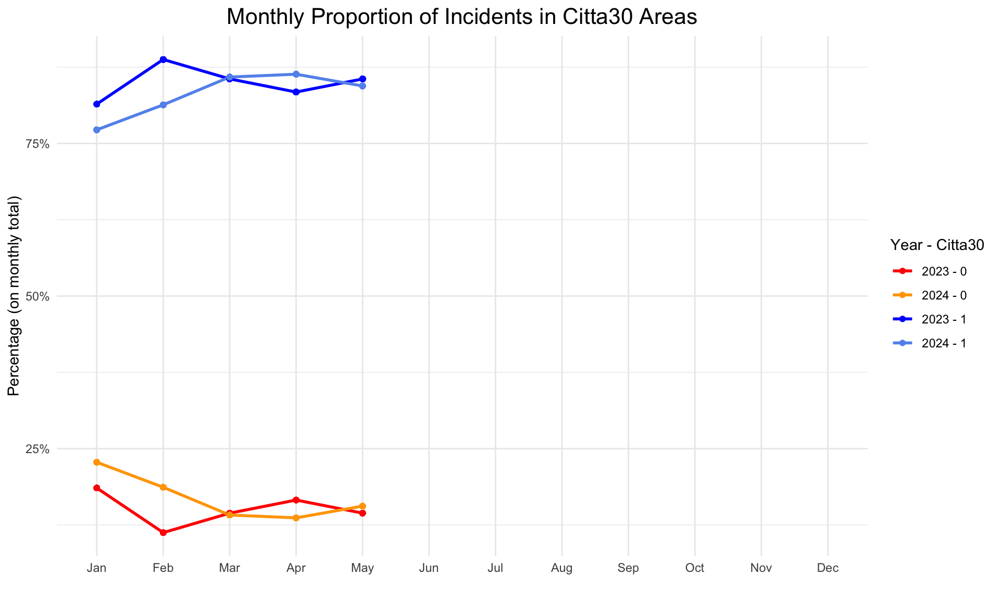

### Analisi della Piramide dell’Età (2023 vs. 2024)

Il grafico sopra mostra la **distribuzione della popolazione per fasce di età e genere** negli anni **2023 e 2024**.  
- **MASCHI** sono rappresentati in **blu** (lato sinistro).  
- **FEMMINE** sono rappresentate in **rosa** (lato destro).  
- L’**asse X** indica la percentuale rispetto al totale della popolazione per ogni anno.  
- L’**asse Y** rappresenta le fasce di età, raggruppate per decenni.  

#### **Osservazioni principali:**
- La **fascia d’età più numerosa** è tra i **20-29 e 30-39 anni**, indicando una popolazione giovane, rispettivamente studenti e lavoratori.
- La fascia **0-9 anni è relativamente più ridotta**.
- La popolazione **over 70** è meno numerosa, ma mostra un leggero aumento nel 2024.
- **La distribuzione tra uomini e donne è skewed verso gli uomini**, con prevalenza per uomini giovani.

### 1. Numero Totale di Incidenti
- Il numero complessivo di incidenti **non ha subito variazioni significative** tra il 2023 e il 2024.
- Ciò suggerisce che l'impatto del progetto "Città 30" potrebbe essere più sulla **gravità** che sulla **frequenza** degli incidenti.

###  2 Codici di Gravità degli Incidenti, usando livello 0,1,2,3 di Valutazione sanitaria

- **Riduzione dei codici rossi** (incidenti più gravi) rispetto al 2023.
- **Aumento dei codici gialli**, indicando una gravità media inferiore degli incidenti.
- **Leggero aumento dei codici verdi**, ma meno significativo rispetto ai gialli.

### 2.1 Codici di Gravità degli Incidenti
- **Riduzione dei codici rossi** (incidenti più gravi) rispetto al 2023.
- **Aumento dei codici gialli**, indicando una gravità media inferiore degli incidenti.
- **Leggero aumento dei codici verdi**, ma meno significativo rispetto ai gialli.

### 3. Andamento Mensile degli Incidenti in "Città 30"
- La percentuale di incidenti nelle aree a **30 km/h è stabile o in leggero aumento**.
- Le zone **fuori da "Città 30"** mantengono un numero di incidenti inferiore.
- Questo suggerisce che il progetto non ha ancora ridotto il numero totale di incidenti, ma ha contribuito a diminuirne la gravità.

### 4. Distribuzione Spaziale degli Incidenti
- Gli incidenti continuano a verificarsi nelle **stesse aree** rispetto all'anno precedente.
- **"0"** indica zone **fuori da Città 30**, mentre **"1"** indica zone **all'interno di Città 30**.
- La **proporzione degli incidenti è 80% - 20%** tra le zone che oggi fanno parte di "Città 30" e quelle esterne.

<iframe src="image_comparison.html" width="100%" height="600px" style="border:none;"></iframe>

